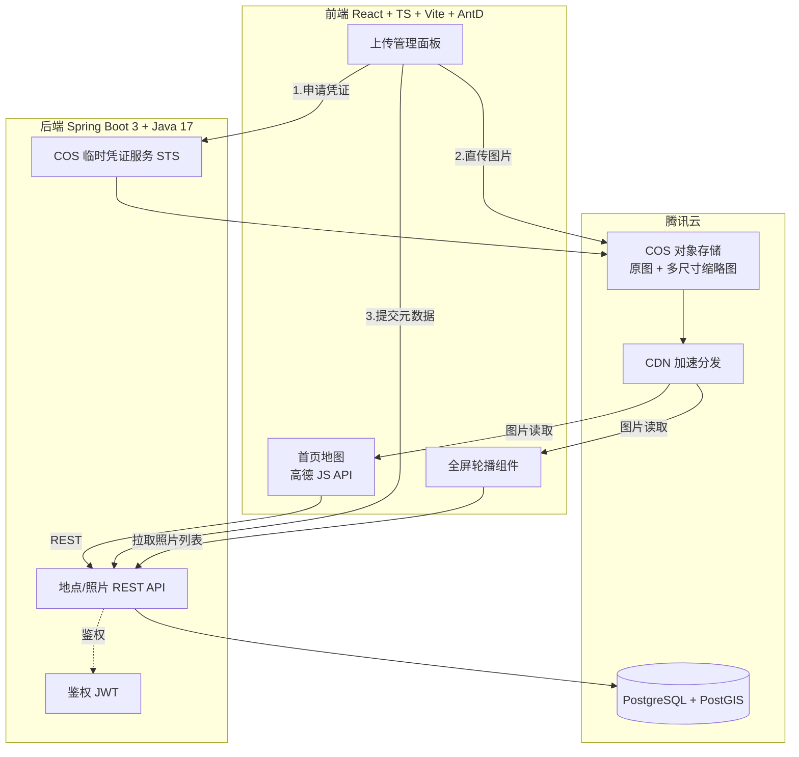
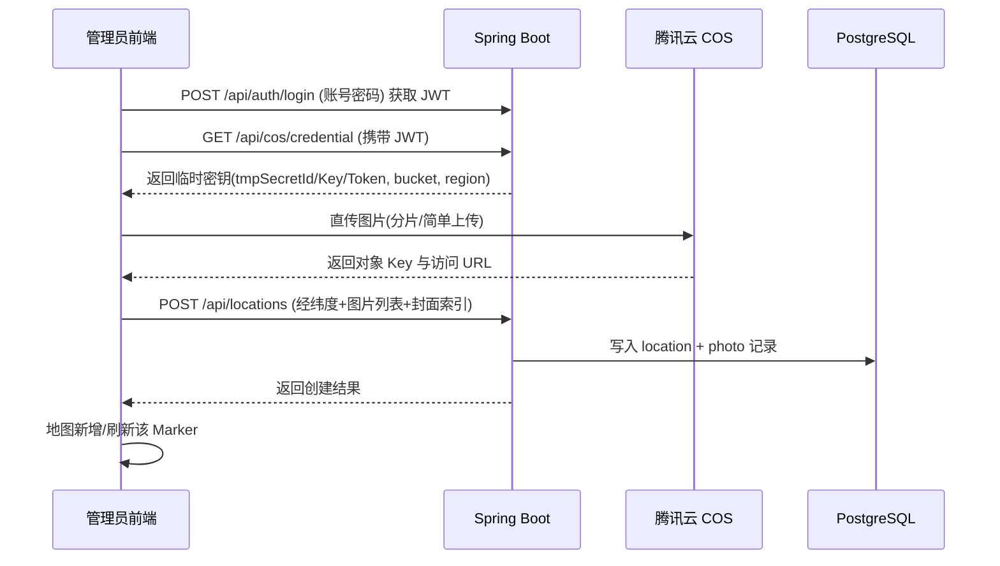
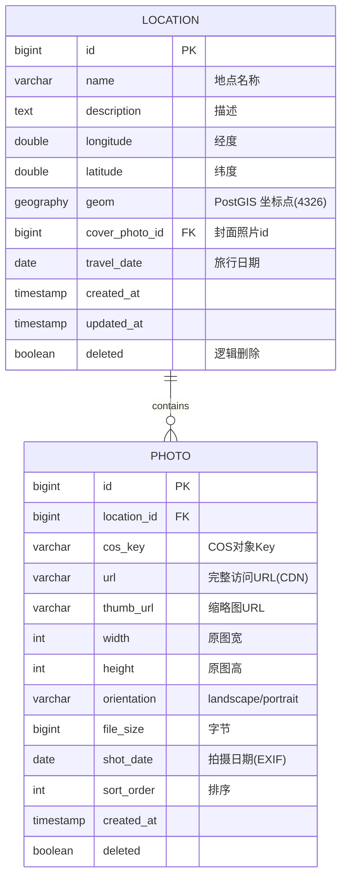

# 旅行摄影地图（Travel Photo Map）产品设计方案

> 版本：v1.0
> 日期：2026-06-09
> 文档用途：可直接投入 AI 代码生成的完整技术与产品设计规格说明书（PRD + 技术设计合一）

---

## 0. 给 AI 代码生成器的执行指引（务必先读）

本文档是一份**可直接喂给 AI 生成代码**的规格说明书。AI 在生成代码时应遵循以下原则：

1. **严格按照本文档的目录结构、数据模型、接口契约生成代码**，不要自行更改字段命名与接口路径。
2. 技术栈固定为：**前端 React 18 + TypeScript + Vite + Ant Design 5 + 高德地图 JS API**；**后端 Spring Boot 3 + Java 17 + MyBatis-Plus**；**数据库 PostgreSQL（含 PostGIS 地理扩展）**；**对象存储腾讯云 COS**。
3. 所有"待补充/可选"项已在文中给出**默认实现方案**，AI 应采用默认方案，无需向用户追问。
4. 涉及密钥（高德 Key、COS SecretId/SecretKey）一律走**环境变量 + 配置中心**，禁止硬编码。
5. 优先保证**核心闭环可运行**：上传图片 → 存 COS → 存经纬度入库 → 地图打点 → 点击看轮播大图。

---

## 1. 产品概述

### 1.1 一句话定位

一个以**地图为核心交互载体**的个人旅行摄影相册：把"去过的每一个地方"以照片封面的形式钉在地图上，点击即可全屏沉浸式浏览该地点的所有照片，用地理坐标串联起一段段旅程记忆。

### 1.2 目标用户与使用场景

| 角色 | 权限 | 典型场景 |
|------|------|----------|
| 管理员（作者本人） | 上传、编辑、删除照片与地点；设置封面 | 旅行回来后，搜索某个景点 → 上传当天拍的照片 → 设为该点封面 |
| 访客（浏览者） | 仅浏览地图、查看照片轮播 | 打开网站 → 在地图上漫游 → 点击封面欣赏旅行照片 |

### 1.3 核心价值

- **空间叙事**：不同于时间线相册，用"地理位置"组织照片，形成可视化的旅行足迹。
- **沉浸体验**：地图封面 + 全屏轮播 + 丰富动效，营造"打开一张照片就像重回现场"的感觉。
- **轻量自持**：单人/管理员维护，无需复杂账户体系，部署成本低。

---

## 2. 功能需求清单（Functional Requirements）

### 2.1 首页地图（FR-01）

- **FR-01-1** 进入首页默认展示全屏地图（高德地图），中心点定位到所有地点的几何中心（无数据时默认定位到某默认城市，如北京）。
- **FR-01-2** 页面背景层：取**所有地点封面图随机/按序轮播**，做**高斯模糊 + 暗化遮罩**处理后作为背景，缓慢横向滚动（Ken Burns 平移缩放效果），地图浮在背景之上（地图容器半透明或带圆角卡片感）。
  - 设计要点：背景轮播切换间隔 6s，淡入淡出 1.2s；模糊半径 30px；遮罩 `rgba(0,0,0,0.45)`。
- **FR-01-3** 地图上每个地点以**该地点的封面照片**作为自定义 Marker（圆形/圆角矩形缩略图 + 白边 + 阴影 + 轻微浮动动画）。
- **FR-01-4** 地点数量多时启用**点聚合（MarkerCluster）**，聚合点显示该簇内照片总数。

### 2.2 地图交互（FR-02）

- **FR-02-1** 地图支持缩放（滚轮/双指）、拖拽平移。
- **FR-02-2** 顶部提供**地点搜索框**（高德 POI 搜索 + 输入提示 AutoComplete），搜索后地图飞行（flyTo）定位到目标点。
- **FR-02-3** 管理员模式下，搜索定位后或**直接点击地图任意位置**，可弹出"在此添加地点"面板，进入上传流程。
- **FR-02-4** 访客模式下，点击地图空白处无添加入口，仅点击已有封面 Marker 才有反馈。

### 2.3 照片上传与地点管理（FR-03，仅管理员）

- **FR-03-1** 上传面板（Ant Design `Modal` + `Upload`）支持：
  - 选择/拖拽多张图片（单次最多 20 张，单张 ≤ 20MB，格式 jpg/jpeg/png/webp/heic）。
  - 自动从图片 EXIF 读取 GPS 经纬度与拍摄时间（若存在），自动回填坐标；无 EXIF 时使用当前地图选点坐标。
  - 填写地点名称（可由搜索结果自动带出）、地点描述、旅行日期。
  - 从已上传图片中**指定一张为地图封面**。
- **FR-03-2** 上传流程：前端先向后端申请 COS 临时上传凭证（STS）→ 前端直传 COS → 上传成功后把图片 URL/Key、经纬度、地点信息提交后端入库。
- **FR-03-3** 支持对已有地点**追加照片**、**更换封面**、**编辑信息**、**删除单张照片**、**删除整个地点**。

### 2.4 全屏照片轮播（FR-04）

- **FR-04-1** 点击地图封面 Marker，以该 Marker 为动画起点，**放大展开**为全屏轮播（共享元素过渡 / scale + fade 动效）。
- **FR-04-2** 轮播支持左右切换（箭头、键盘 ←→、移动端左右滑动手势）、缩略图条导航、自动播放开关。
- **FR-04-3** 图片兼容横版与竖版：采用 `object-fit: contain` 居中显示，**永不裁剪变形**；背景用该图模糊版填充画布留白区域。
- **FR-04-4** 支持双击/双指放大查看细节（图片缩放查看，pinch-zoom）。
- **FR-04-5** 显示当前图片的元信息：序号（3/12）、拍摄日期、地点名称、可选文字说明。
- **FR-04-6** 关闭时**收缩动画**回到地图 Marker 位置。

### 2.5 非功能性需求（NFR）

| 编号 | 需求 | 指标 |
|------|------|------|
| NFR-01 | 首屏加载 | 地图与首批 Marker ≤ 2.5s（4G 网络） |
| NFR-02 | 图片性能 | 列表/Marker 用缩略图（COS 图片处理生成 200px/600px 多尺寸）；轮播大图懒加载 + 预加载相邻 1 张 |
| NFR-03 | 移动端适配 | 响应式布局，触控手势完整可用 |
| NFR-04 | 安全 | COS 走临时凭证；管理员接口需鉴权；图片 URL 走防盗链或签名 |
| NFR-05 | 兼容性 | Chrome / Safari / Edge 最近两个大版本；iOS Safari、Android Chrome |

---

## 3. 系统架构设计

### 3.1 总体架构图



### 3.2 数据流（上传一张照片的完整链路）



### 3.3 技术栈与版本

| 层 | 技术 | 版本 | 说明 |
|----|------|------|------|
| 前端框架 | React | 18.x | 函数组件 + Hooks |
| 语言 | TypeScript | 5.x | 全量类型 |
| 构建 | Vite | 5.x | 快、HMR |
| UI | Ant Design | 5.x | 组件库 |
| 地图 | 高德地图 JS API | 2.0 | `@amap/amap-jsapi-loader` 加载 |
| 状态管理 | Zustand | 4.x | 轻量，替代 Redux |
| 请求 | Axios | 1.x | 拦截器注入 JWT |
| 动效 | Framer Motion | 11.x | 共享元素过渡、轮播动画 |
| 轮播 | Swiper | 11.x | 全屏轮播 + 手势缩放 |
| 后端框架 | Spring Boot | 3.2.x | Java 17 |
| ORM | MyBatis-Plus | 3.5.x | 单表 CRUD 高效 |
| 数据库 | PostgreSQL | 15.x | + PostGIS 3.x 地理扩展 |
| 连接池 | HikariCP | 内置 | |
| 鉴权 | JWT (jjwt) | 0.12.x | 无状态 |
| 对象存储 SDK | cos-java-sdk-v5 / 前端 cos-js-sdk-v5 | 最新 | |
| 部署 | Docker + Docker Compose | | 腾讯云 CVM |

> **数据库选型说明**：默认采用 PostgreSQL + PostGIS，因为它原生支持 `geography` 类型与 `ST_DWithin` 等地理函数，便于实现"查询地图当前视野范围内的点""查找附近地点"等需求，扩展性更好。
> **若改用 MySQL**：将 `geography(Point,4326)` 字段拆为 `latitude DOUBLE` + `longitude DOUBLE` 两列，用 BETWEEN 范围查询替代空间索引即可，其余设计不变。

---

## 4. 数据库设计（PostgreSQL + PostGIS）

### 4.1 ER 图



### 4.2 建表 SQL

```sql
-- 启用 PostGIS 扩展（需 PostgreSQL 已安装 postgis）
CREATE EXTENSION IF NOT EXISTS postgis;

-- 地点表
CREATE TABLE location (
    id              BIGSERIAL PRIMARY KEY,
    name            VARCHAR(128) NOT NULL,
    description     TEXT,
    longitude       DOUBLE PRECISION NOT NULL,
    latitude        DOUBLE PRECISION NOT NULL,
    geom            GEOGRAPHY(Point, 4326),           -- 空间字段，便于范围/附近查询
    cover_photo_id  BIGINT,                           -- 封面照片，关联 photo.id
    travel_date     DATE,
    created_at      TIMESTAMP NOT NULL DEFAULT now(),
    updated_at      TIMESTAMP NOT NULL DEFAULT now(),
    deleted         BOOLEAN NOT NULL DEFAULT FALSE
);
CREATE INDEX idx_location_geom ON location USING GIST (geom);
CREATE INDEX idx_location_deleted ON location (deleted);

-- 照片表
CREATE TABLE photo (
    id          BIGSERIAL PRIMARY KEY,
    location_id BIGINT NOT NULL REFERENCES location(id),
    cos_key     VARCHAR(512) NOT NULL,
    url         VARCHAR(1024) NOT NULL,
    thumb_url   VARCHAR(1024),
    width       INT,
    height      INT,
    orientation VARCHAR(16),                          -- landscape / portrait / square
    file_size   BIGINT,
    shot_date   DATE,
    sort_order  INT NOT NULL DEFAULT 0,
    created_at  TIMESTAMP NOT NULL DEFAULT now(),
    deleted     BOOLEAN NOT NULL DEFAULT FALSE
);
CREATE INDEX idx_photo_location ON photo (location_id);
CREATE INDEX idx_photo_deleted ON photo (deleted);

-- 触发器：写入 longitude/latitude 时自动生成 geom（也可在应用层写入）
CREATE OR REPLACE FUNCTION set_geom() RETURNS trigger AS $$
BEGIN
    NEW.geom := ST_SetSRID(ST_MakePoint(NEW.longitude, NEW.latitude), 4326)::geography;
    RETURN NEW;
END;
$$ LANGUAGE plpgsql;

CREATE TRIGGER trg_location_geom
    BEFORE INSERT OR UPDATE OF longitude, latitude ON location
    FOR EACH ROW EXECUTE FUNCTION set_geom();
```

---

## 5. 后端 API 设计（RESTful）

### 5.1 通用约定

- Base URL：`/api`
- 统一响应体：

```json
{
  "code": 0,
  "message": "success",
  "data": {}
}
```

- 鉴权：管理员接口在请求头携带 `Authorization: Bearer <JWT>`；查询类接口公开。
- 错误码：`0` 成功；`401` 未授权；`403` 无权限；`400` 参数错误；`500` 服务异常。

### 5.2 接口清单

| 方法 | 路径 | 鉴权 | 说明 |
|------|------|------|------|
| POST | `/api/auth/login` | 否 | 管理员登录，返回 JWT |
| GET | `/api/cos/credential` | 是 | 获取 COS 临时上传凭证（STS） |
| GET | `/api/locations` | 否 | 获取地点列表（可带 bbox 视野范围过滤） |
| GET | `/api/locations/{id}` | 否 | 获取单个地点详情（含全部照片） |
| POST | `/api/locations` | 是 | 创建地点（含照片列表、封面索引） |
| PUT | `/api/locations/{id}` | 是 | 更新地点信息/封面 |
| DELETE | `/api/locations/{id}` | 是 | 删除地点（逻辑删除，含其照片） |
| POST | `/api/locations/{id}/photos` | 是 | 给已有地点追加照片 |
| DELETE | `/api/photos/{id}` | 是 | 删除单张照片 |

### 5.3 关键接口契约（请求/响应示例）

**POST /api/auth/login**
```json
// 请求
{ "username": "admin", "password": "******" }
// 响应 data
{ "token": "eyJ...", "expiresIn": 86400 }
```

**GET /api/cos/credential**
```json
// 响应 data
{
  "tmpSecretId": "AKID...",
  "tmpSecretKey": "...",
  "sessionToken": "...",
  "bucket": "travel-photo-1300000000",
  "region": "ap-guangzhou",
  "startTime": 1717900000,
  "expiredTime": 1717901800,
  "allowPrefix": "photos/2026/"   // 限制上传路径
}
```

**GET /api/locations?bbox=minLng,minLat,maxLng,maxLat**
```json
// 响应 data（列表）
[
  {
    "id": 1,
    "name": "杭州西湖",
    "longitude": 120.155,
    "latitude": 30.245,
    "travelDate": "2026-04-12",
    "coverThumbUrl": "https://cdn.../photos/.../cover_600.webp",
    "photoCount": 12
  }
]
```

**POST /api/locations**
```json
// 请求
{
  "name": "杭州西湖",
  "description": "春天的断桥",
  "longitude": 120.155,
  "latitude": 30.245,
  "travelDate": "2026-04-12",
  "coverIndex": 0,
  "photos": [
    {
      "cosKey": "photos/2026/04/uuid1.jpg",
      "url": "https://cdn.../uuid1.jpg",
      "thumbUrl": "https://cdn.../uuid1_600.webp",
      "width": 4000, "height": 6000,
      "orientation": "portrait",
      "fileSize": 5242880,
      "shotDate": "2026-04-12"
    }
  ]
}
// 响应 data
{ "id": 1 }
```

**GET /api/locations/{id}**
```json
// 响应 data
{
  "id": 1,
  "name": "杭州西湖",
  "description": "春天的断桥",
  "longitude": 120.155,
  "latitude": 30.245,
  "travelDate": "2026-04-12",
  "coverPhotoId": 100,
  "photos": [
    {
      "id": 100, "url": "https://cdn.../uuid1.jpg",
      "thumbUrl": "https://cdn.../uuid1_600.webp",
      "width": 4000, "height": 6000, "orientation": "portrait",
      "shotDate": "2026-04-12", "sortOrder": 0
    }
  ]
}
```

### 5.4 后端模块/包结构

```
src/main/java/com/photomap/
├── PhotoMapApplication.java
├── config/
│   ├── CorsConfig.java
│   ├── WebSecurityConfig.java        # JWT 过滤、放行公开接口
│   └── CosProperties.java            # 读取 cos 配置
├── controller/
│   ├── AuthController.java
│   ├── CosController.java            # /api/cos/credential
│   ├── LocationController.java
│   └── PhotoController.java
├── service/
│   ├── AuthService.java
│   ├── CosStsService.java            # 调腾讯云 STS 生成临时密钥
│   ├── LocationService.java
│   └── PhotoService.java
├── mapper/                           # MyBatis-Plus Mapper
│   ├── LocationMapper.java
│   └── PhotoMapper.java
├── entity/
│   ├── Location.java
│   └── Photo.java
├── dto/
│   ├── LoginRequest.java
│   ├── LocationCreateRequest.java
│   ├── LocationVO.java
│   └── PhotoVO.java
├── common/
│   ├── ApiResponse.java
│   ├── BusinessException.java
│   └── GlobalExceptionHandler.java
└── util/
    └── JwtUtil.java
```

### 5.5 COS 临时凭证服务关键逻辑（Java 伪代码）

```java
// CosStsService.java
public CosCredential getCredential() {
    TreeMap<String, Object> config = new TreeMap<>();
    config.put("secretId", cosProperties.getSecretId());      // 永久密钥(环境变量)
    config.put("secretKey", cosProperties.getSecretKey());
    config.put("durationSeconds", 1800);                       // 30 分钟
    config.put("bucket", cosProperties.getBucket());
    config.put("region", cosProperties.getRegion());
    // 仅允许上传到 photos/yyyy/MM/ 前缀，限制权限
    String prefix = "photos/" + yyyyMM() + "/*";
    config.put("allowPrefixes", new String[]{ prefix });
    config.put("allowActions", new String[]{
        "name/cos:PutObject", "name/cos:PostObject",
        "name/cos:InitiateMultipartUpload", "name/cos:ListMultipartUploads",
        "name/cos:ListParts", "name/cos:UploadPart", "name/cos:CompleteMultipartUpload"
    });
    Response resp = CosStsClient.getCredential(config);
    return convert(resp);   // 转为前端可用的 DTO
}
```

---

## 6. 前端设计

### 6.1 目录结构

```
src/
├── main.tsx
├── App.tsx
├── router.tsx
├── api/
│   ├── request.ts            # axios 实例 + 拦截器
│   ├── location.ts
│   ├── auth.ts
│   └── cos.ts
├── store/
│   ├── useAuthStore.ts       # zustand：登录态、是否管理员
│   └── useMapStore.ts        # 地点数据、当前选中点
├── pages/
│   ├── Home/
│   │   ├── index.tsx         # 首页：背景轮播 + 地图
│   │   └── Home.module.css
│   └── Login/
│       └── index.tsx         # 管理员登录
├── components/
│   ├── MapView/
│   │   ├── MapView.tsx       # 高德地图封装
│   │   ├── PhotoMarker.tsx   # 封面 Marker（自定义内容）
│   │   └── SearchBox.tsx     # POI 搜索框
│   ├── BlurredCarousel/
│   │   └── index.tsx         # 背景模糊轮播
│   ├── UploadPanel/
│   │   ├── index.tsx         # 上传/编辑地点 Modal
│   │   └── useExif.ts        # 读取图片 EXIF GPS
│   └── FullscreenGallery/
│       └── index.tsx         # 全屏轮播大图（Swiper + Framer Motion）
├── hooks/
│   ├── useAmap.ts            # 高德 JS API 加载
│   └── useResponsive.ts
├── types/
│   └── index.ts             # Location / Photo 类型定义
├── utils/
│   ├── image.ts             # 缩略图 URL 拼接、方向判断
│   └── cosUpload.ts         # 调用 cos-js-sdk-v5 直传
└── styles/
    └── global.css
```

### 6.2 核心 TypeScript 类型定义

```typescript
// types/index.ts
export type Orientation = 'landscape' | 'portrait' | 'square';

export interface Photo {
  id: number;
  url: string;
  thumbUrl: string;
  width: number;
  height: number;
  orientation: Orientation;
  shotDate?: string;
  sortOrder: number;
}

export interface Location {
  id: number;
  name: string;
  description?: string;
  longitude: number;
  latitude: number;
  travelDate?: string;
  coverPhotoId?: number;
  coverThumbUrl?: string;
  photoCount: number;
  photos?: Photo[];
}
```

### 6.3 关键页面/组件实现要点

**首页 Home**
- 使用 `useAmap` 加载高德地图，地图初始化后调用 `GET /api/locations` 拉取所有点。
- 背景层渲染 `<BlurredCarousel>`，取所有 `coverThumbUrl` 做模糊轮播。
- 地图层渲染所有 `<PhotoMarker>`，点击触发打开 `<FullscreenGallery>`。
- 管理员（`useAuthStore.isAdmin`）才渲染搜索后/点击地图的"添加地点"入口与 `<UploadPanel>`。

**MapView / PhotoMarker（高德地图自定义 Marker）**
```typescript
// 用高德 AMap.Marker + 自定义 content 渲染圆角封面
const marker = new AMap.Marker({
  position: [location.longitude, location.latitude],
  content: `
    <div class="photo-marker">
      
      <span class="count">${location.photoCount}</span>
    </div>`,
  offset: new AMap.Pixel(-28, -28),
  anchor: 'center',
});
marker.on('click', () => openGallery(location.id));
```
- 点聚合：使用高德 `AMap.MarkerCluster` 插件，`renderClusterMarker` 自定义聚合样式。

**SearchBox（POI 搜索）**
- 使用高德 `AMap.AutoComplete` 做输入提示 + `AMap.PlaceSearch` 做检索；选中后 `map.setZoomAndCenter` 飞行定位；管理员状态下自动带出地点名与坐标到上传面板。

**UploadPanel（上传，仅管理员）**
- Ant Design `Upload` 组件 `customRequest` 拦截：
  1. 读取 EXIF（`exifr` 库）获取 GPS 与拍摄时间；
  2. 调 `GET /api/cos/credential` 拿临时凭证；
  3. 用 `cos-js-sdk-v5` 直传 COS（大图走分片上传，带进度条）；
  4. 收集所有图片返回信息，提交 `POST /api/locations`。
- 上传成功后调用回调刷新地图 Marker。

**FullscreenGallery（全屏轮播）**
- 用 `Swiper`（modules: Navigation, Pagination, Zoom, Keyboard, Virtual）。
- 容器为全屏 `position: fixed`，黑色半透明背景。
- 每张 slide：`swiper-zoom-container` 包裹 ``，`object-fit: contain`；slide 背景放同图模糊版填白边。
- 横竖版自适应：根据 `orientation` 不加任何裁剪，容器 flex 居中。
- 顶部显示 `当前序号 / 总数`、地点名、拍摄日期；底部缩略图条。
- 移动端：开启 `Swiper` 触摸滑动 + `zoom` 双指缩放。

---

## 7. 动效设计（核心体验，简洁炫酷）

> 统一用 **Framer Motion**（React 组件过渡）+ **CSS transition/animation**（轻量交互）+ **Swiper**（轮播）。动效原则：**克制、流畅、有空间感**，缓动统一用 `cubic-bezier(0.4, 0, 0.2, 1)`（Material 标准），时长 200–500ms。

| 场景 | 动效 | 实现 |
|------|------|------|
| 首页进入 | 地图淡入 + 背景模糊层缓慢平移放大（Ken Burns） | CSS `@keyframes` 无限 alternate；Framer `initial/animate` 淡入 |
| Marker 呈现 | 依次错落弹入（stagger），轻微上下浮动 | Framer `staggerChildren`；CSS float 动画 |
| Marker 悬停 | 放大 1.1 倍 + 阴影加深 | CSS `transform: scale` transition |
| 点击 Marker → 打开轮播 | **共享元素过渡**：封面从地图位置放大铺满全屏 | Framer Motion `layoutId`（Marker 与大图共用 layoutId） |
| 轮播切换 | 滑动 + 视差/淡入 | Swiper `effect: 'slide'` 或 `'fade'`，可选 `creative` 效果 |
| 关闭轮播 | 收缩回 Marker 位置 + 背景淡出 | Framer `AnimatePresence` + layout 反向过渡 |
| 上传成功 | 新 Marker 以"落点 + 涟漪"动画出现 | CSS ripple keyframes |
| 搜索飞行 | 地图平滑飞行定位 | 高德 `setZoomAndCenter(zoom, center, false, 600)` |
| 加载态 | 骨架屏 / 模糊渐显（LQIP，先显缩略图再渐显大图） | AntD Skeleton + CSS `filter: blur` 渐变 |

**共享元素过渡关键代码（Framer Motion）**
```tsx
// Marker 与全屏大图共用同一个 layoutId 实现"放大展开"
<motion.img layoutId={`cover-${location.id}`} src={cover} /> // 地图上
// 打开时
<AnimatePresence>
  {open && (
    <motion.div className="gallery-overlay"
      initial={{ opacity: 0 }} animate={{ opacity: 1 }} exit={{ opacity: 0 }}>
      <motion.img layoutId={`cover-${location.id}`} src={cover} />
      {/* ...Swiper... */}
    </motion.div>
  )}
</AnimatePresence>
```

---

## 8. 腾讯云资源与配置

### 8.1 资源清单

| 资源 | 用途 | 规格建议 |
|------|------|----------|
| COS 存储桶 | 存原图 + 缩略图 | 标准存储，开启图片处理（CI），区域同 CVM |
| CDN | 加速图片分发 | 绑定 COS 源站，开启 HTTPS、防盗链（Referer 白名单） |
| CVM 云服务器 | 跑后端 + 数据库（或单独云数据库） | 2核4G 起，按量/包年 |
| 云数据库 PostgreSQL | 生产数据库（可选，替代自建） | 高可用版按需 |
| CAM 子账号 | 后端调 STS 用的永久密钥 | **最小权限**：仅 STS 与目标 COS 桶 |

### 8.2 COS 图片处理（生成多尺寸缩略图）

利用 COS 数据万象（CI）样式或 URL 参数生成缩略图，避免后端处理：
- 列表/Marker 缩略图：`原图URL?imageMogr2/thumbnail/200x/format/webp`
- 轮播中等图：`原图URL?imageMogr2/thumbnail/1200x/format/webp`
- 也可配置「样式分隔符 + 预设样式」，存库时直接拼好 `thumbUrl`。

### 8.3 配置项（环境变量）

```yaml
# application.yml（值从环境变量注入，禁止硬编码）
cos:
  secret-id: ${COS_SECRET_ID}
  secret-key: ${COS_SECRET_KEY}
  bucket: ${COS_BUCKET}            # 如 travel-photo-1300000000
  region: ${COS_REGION}           # 如 ap-guangzhou
  cdn-domain: ${COS_CDN_DOMAIN}   # 如 https://img.example.com
spring:
  datasource:
    url: jdbc:postgresql://${DB_HOST}:5432/photomap
    username: ${DB_USER}
    password: ${DB_PASSWORD}
jwt:
  secret: ${JWT_SECRET}
  expire-seconds: 86400
admin:
  username: ${ADMIN_USERNAME}
  password-hash: ${ADMIN_PASSWORD_HASH}   # BCrypt
amap:
  # 前端用，写在前端 .env：VITE_AMAP_KEY / VITE_AMAP_SECURITY_CODE
```

前端 `.env`：
```
VITE_AMAP_KEY=你的高德Key
VITE_AMAP_SECURITY_CODE=你的高德安全密钥
VITE_API_BASE=/api
```

---

## 9. 部署方案（Docker）

### 9.1 docker-compose.yml（示意）

```yaml
version: "3.8"
services:
  db:
    image: postgis/postgis:15-3.4
    environment:
      POSTGRES_DB: photomap
      POSTGRES_USER: ${DB_USER}
      POSTGRES_PASSWORD: ${DB_PASSWORD}
    volumes:
      - pgdata:/var/lib/postgresql/data
      - ./init.sql:/docker-entrypoint-initdb.d/init.sql
  backend:
    build: ./backend
    depends_on: [db]
    environment:
      DB_HOST: db
      COS_SECRET_ID: ${COS_SECRET_ID}
      COS_SECRET_KEY: ${COS_SECRET_KEY}
      COS_BUCKET: ${COS_BUCKET}
      COS_REGION: ${COS_REGION}
      JWT_SECRET: ${JWT_SECRET}
    ports: ["8080:8080"]
  frontend:
    build: ./frontend
    depends_on: [backend]
    ports: ["80:80"]   # nginx 托管静态资源 + 反代 /api 到 backend
volumes:
  pgdata:
```

- 前端构建为静态文件，由 Nginx 托管，`/api` 反向代理到 `backend:8080`，规避跨域。
- 后端 Dockerfile：多阶段构建（maven 编译 → jre 运行）。

### 9.2 上线检查清单

- [ ] 高德 Key 已配置 Web 服务白名单与安全密钥
- [ ] COS 桶权限为私有读，通过 CDN + 签名/防盗链访问
- [ ] CAM 子账号最小权限
- [ ] 数据库初始化脚本（含 PostGIS 扩展）执行成功
- [ ] HTTPS 证书配置（Nginx）
- [ ] 管理员密码以 BCrypt 存储

---

## 10. 安全与边界处理

- **鉴权**：所有写操作接口（POST/PUT/DELETE）必须校验 JWT 且为 admin 角色。
- **COS 直传安全**：用临时凭证（STS），限制 `allowPrefix` 与 30 分钟有效期；前端不接触永久密钥。
- **图片防盗链**：CDN 配置 Referer 白名单；如需更强保护改用 URL 签名鉴权。
- **上传校验**：前端 + 后端双重校验文件类型、大小；后端校验经纬度范围（lng∈[-180,180], lat∈[-90,90]）。
- **HEIC 兼容**：iPhone HEIC 在前端用 `heic2any` 转 webp/jpg 后再上传，避免浏览器不识别。
- **EXIF GPS 缺失**：回退到地图选点坐标；坐标系注意——高德用 GCJ-02，EXIF/GPS 为 WGS-84，需做 `wgs84togcj02` 坐标转换后再打点。
- **删除一致性**：删除地点/照片时，逻辑删除数据库记录；COS 对象可异步定时清理（避免误删导致 CDN 缓存问题）。
- **XSS**：地点名/描述渲染做转义。

---

## 11. 风险与已知坑（提醒）

| 风险 | 说明 | 应对 |
|------|------|------|
| 坐标系偏移 | 高德 GCJ-02 与 GPS/WGS-84 不一致，直接打点会偏移百米 | 上传时统一转 GCJ-02 入库，或入库存 WGS-84、展示时转换（需全局统一一种策略） |
| HEIC 不显示 | Safari 外多数浏览器不支持 HEIC | 前端转码后上传 |
| 大图加载卡顿 | 原图几 MB，轮播直出会卡 | 多尺寸缩略图 + 懒加载 + 相邻预加载 |
| 高德 Key 配额 | 免费配额有限 | 监控用量，必要时升企业版 |
| 移动端手势冲突 | 地图拖拽与页面滚动、轮播缩放与切换冲突 | 全屏轮播时锁定 body 滚动；明确手势优先级 |

---

## 12. 迭代规划（建议）

**MVP（第一期，必做）**
- 首页地图 + 自定义封面 Marker
- 管理员登录、上传图片到 COS、存经纬度入库
- 点击 Marker 全屏轮播（横竖版兼容）
- 背景模糊轮播 + 核心动效（共享元素过渡）

**第二期（增强）**
- 点聚合、视野范围按需加载
- EXIF 自动定位、HEIC 转码
- 旅行路线连线（按时间把点连成轨迹）、时间轴筛选

**第三期（可选）**
- 多用户系统、分享单个地点链接
- 地图主题/暗色模式切换
- 照片描述富文本、地点标签分类

---

## 13. 验收标准（AI 生成后自检）

1. 本地 `docker-compose up` 后，前端可访问、地图正常渲染。
2. 管理员登录后能成功上传一张照片并在地图上看到封面 Marker。
3. 点击 Marker 能全屏轮播查看，横版与竖版图片均不变形、可左右切换。
4. 背景模糊轮播正常滚动，动效流畅无明显卡顿。
5. 访客（未登录）无任何上传/编辑入口，但可正常浏览。
6. 移动端浏览器下手势（拖拽地图、滑动轮播、双指缩放）均可用。

---

*（文档结束。AI 生成代码时如遇本文档未覆盖的细节，按"简洁、安全、可运行"原则采用业界默认实践，并在代码注释中标注 TODO。）*